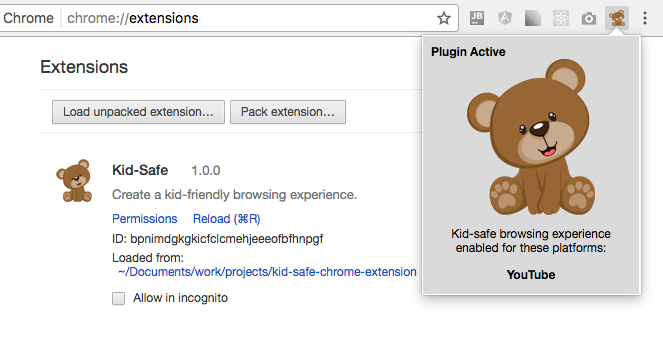

# Helping Hand Chrome Extension (skeleton).

A base extension for starting out projects.

To install the extension, click on the Chrome -> Preferences -> Extensions.

Since the extension is unpacked and local, you will need to turn on *Developer mode* in order to load it up.

## Other addons utilizing 'Helping Hand':

Enjoy & use at your own discretion.
