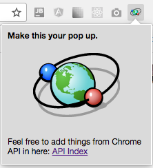

# Helping Hand Chrome Extension (skeleton).

A base extension for starting out projects.

To install the extension, click on the Chrome -> Preferences -> Extensions.

Enjoy & use at your own discretion.
